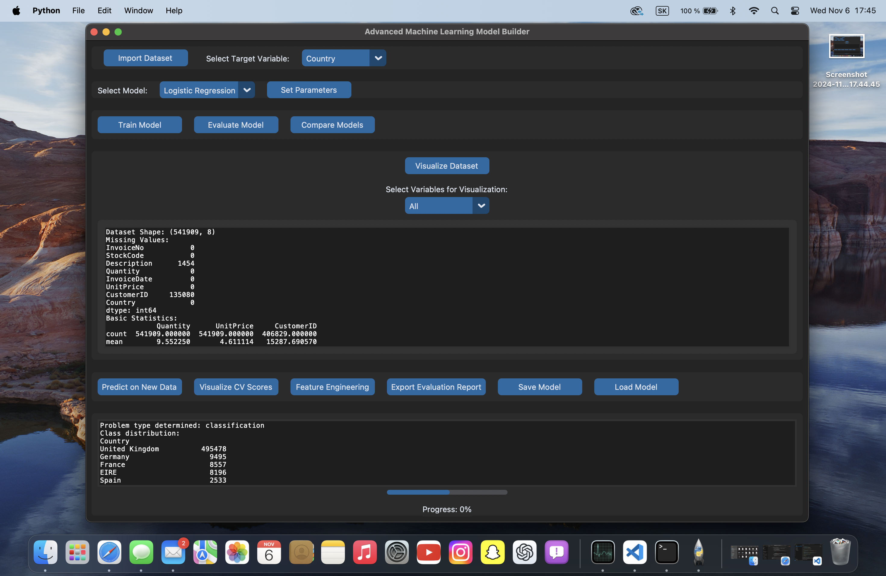
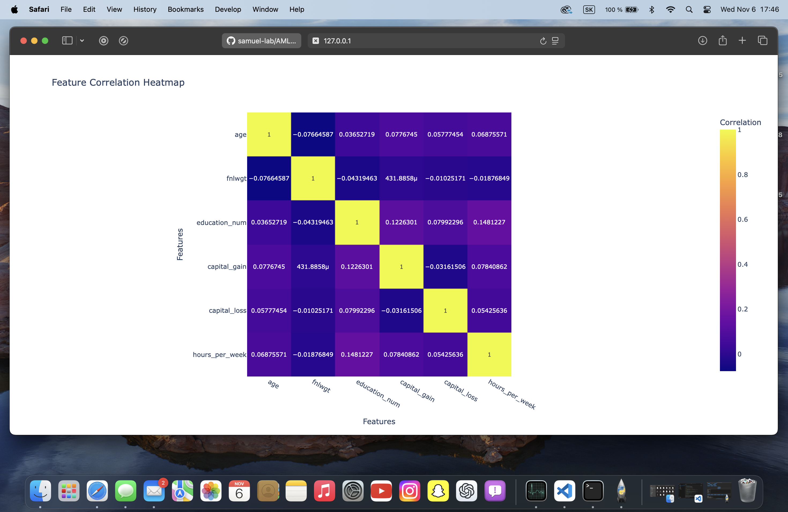
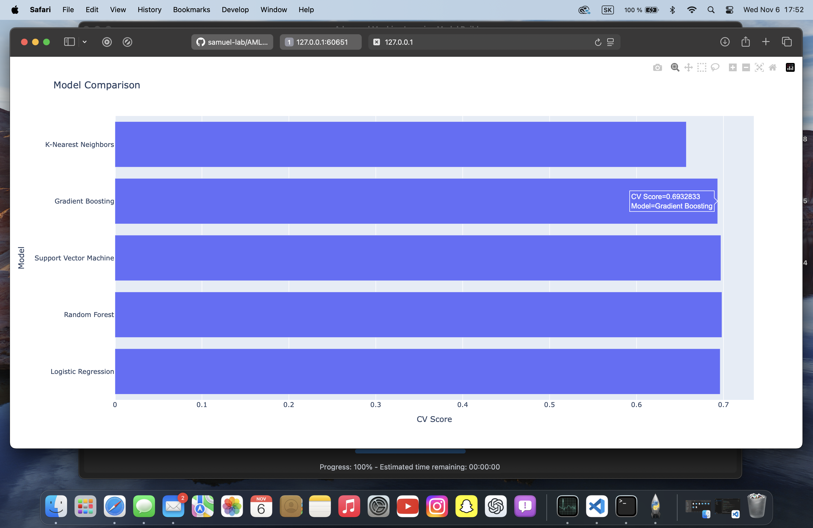
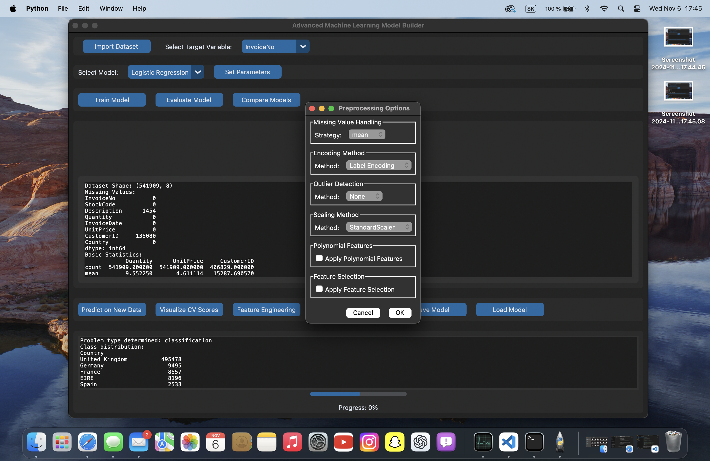

# AMLB - Advanced Machine Learning Builder

## Introduction

AMLB (Advanced Machine Learning Builder) is an intuitive Python application that empowers users to build, train, and visualize machine learning models through a graphical interface. Built to bridge the gap between data science expertise and end-user accessibility, AMLB provides a robust environment for data preparation, feature engineering, model selection,and performance evaluation, making it an essential tool for both beginner and experienced data enthusiasts.

## Project Images

### Main Application Interface


### Data Heatmap
This heatmap shows key data insights.


### Model Comparison
Here, you can compare different machine learning models.


### Data Preprocessing

This section covers data preprocessing steps.


---

## Project Architecture
The AMLB application is modularized to enhance scalability and maintainability:
- **Core Modules**:
  - `ml/`: Machine learning modules handling data preprocessing, feature engineering, model training, and evaluation.
  - `visualization/`: Visualization utilities for displaying insights like feature importance and model performance.
  - `utils/`: Helper functions and logging configuration to ensure smooth execution and error tracking.
- **Graphical User Interface**:
  - `gui/`: CustomTkinter-based GUI for interactive model selection, training, and performance analysis.

This structure supports a clear separation of concerns, allowing seamless updates or module enhancements.

# Datasets
This project includes a `/datasets` folder containing six datasets of varying sizes, allowing comprehensive testing of the app's capabilities. You can use these datasets to evaluate performance, scalability, and processing speed.


## Key Features
1. **Interactive Model Training**:
   - Choose from a variety of machine learning models, with parameters adjustable through the GUI.
2. **Comprehensive Evaluation**:
   - View detailed performance metrics such as accuracy, precision, recall, and F1 score.
3. **Feature Engineering Tools**:
   - Includes encoding, normalization, and feature selection utilities to optimize model input.
4. **Visualization**:
   - Real-time data and result visualizations, including training history and feature importance.
5. **User-Friendly GUI**:
   - A modern, easy-to-navigate interface designed with CustomTkinter, allowing users to focus on experimentation.

   
## Key Functions

### Model Selection and Training
- **`train_model`**: This function initiates the training process for the selected model using preprocessed data. It captures user-selected preprocessing options such as scaling, encoding, and feature engineering, and applies them before model training.

- **`compare_models`**: This function allows comparison of various models using cross-validation, enabling users to identify the best model based on performance metrics.

- **`feature_engineering`**: A feature engineering function that applies techniques such as polynomial features and scaling to improve model performance. The function also allows selection of specific transformations based on user input.

- **`save_model`**: This function saves the trained model along with its preprocessing steps, metadata, and evaluation metrics to a file. The saved model can later be reloaded for further analysis or predictions.

- **`load_model`**: This function loads a previously saved model, including its preprocessing steps and metadata, so it can be used for new predictions or further evaluation.

### Evaluation and Visualization
- **`evaluate_model`**: This function evaluates the trained model by calculating various performance metrics, such as accuracy, precision, recall, and F1 score. The results are displayed in the GUI, allowing users to analyze the model’s effectiveness.

- **`visualize_cv_scores`**: This function provides visualization of cross-validation scores for the selected model. It’s useful for assessing model stability and performance across different data splits.

- **`visualize_data`**: This function offers visualization capabilities for dataset variables, helping users understand data distributions, correlations, and potential preprocessing requirements.

### Prediction and Export
- **`predict_new_data`**: This function allows users to make predictions on new data using the trained model. It reads the new data from a CSV file, preprocesses it according to the saved pipeline, and generates predictions, which can then be saved.

- **`export_evaluation_report`**: Exports the evaluation metrics generated by `evaluate_model` as a CSV file. This feature allows users to maintain a record of model performance.

---

## GUI Settings and Options

### Preprocessing Options (`dialogs.py`)
The following options are available through the preprocessing options dialog:

- **Missing Value Handling**:
  - **Strategy**: Select how to handle missing values. Options include:
    - `mean`: Fills missing values with the mean of the column.
    - `median`: Uses the median for filling.
    - `most_frequent`: Fills with the most frequent value in the column.
    - `constant`: Uses a specific constant value for filling.
  - **Fill Value**: When `constant` is selected, you can specify a fill value.

- **Encoding Method**:
  - Options for encoding categorical data include:
    - `Label Encoding`: Assigns each unique category an integer.
    - `One-Hot Encoding`: Creates binary columns for each category.
    - `Ordinal Encoding`: Maps categories to an ordinal scale.

- **Outlier Detection**:
  - Choose from methods to detect and handle outliers:
    - `None`: No outlier detection.
    - `Z-Score`: Detects outliers based on Z-score.
    - `IQR`: Uses the Interquartile Range to find outliers.

- **Scaling Method**:
  - Options to scale numerical data include:
    - `StandardScaler`: Standardizes features by removing the mean and scaling to unit variance.
    - `MinMaxScaler`: Scales features to a range, often [0, 1].
    - `RobustScaler`: Scales using median and IQR, reducing the influence of outliers.

- **Polynomial Features**:
  - **Apply Polynomial Features**: Enables polynomial transformation, creating interaction terms up to a specified degree.
  - **Degree**: Sets the polynomial degree to be applied when `Apply Polynomial Features` is selected.

- **Feature Selection**:
  - **Apply Feature Selection**: Enables selection of the most relevant features based on the chosen method.
  - **Method**:
    - `Correlation Threshold`: Selects features with a correlation coefficient above a specified threshold.
    - `Recursive Feature Elimination`: Selects features by recursively considering smaller feature sets.
  - **Threshold**: For the `Correlation Threshold` method, specifies the minimum correlation value.
  - **Number of Features**: For `Recursive Feature Elimination`, defines the number of top features to retain.
---
## Installation

### Requirements
Ensure that Python 3.7+ and pip are installed. Docker installation is optional but recommended for streamlined setup.

### Steps
1. **Clone the repository**:
   ```bash
   git clone https://github.com/username/AMLB.git
   ```
2. **Navigate to the project directory**:
   ```bash
   cd AMLB
   ```
3. **Install the required dependencies**:
   ```bash
   pip install -r requirements.txt
   ```
4. *(Optional)* **Run in Docker**:
   ```bash
   docker build -t amlb .
   docker run -p 8501:8501 amlb
   ```

---
## Usage

1. **Start the application**:
   ```bash
   python main.py
   ```
2. **Using the GUI**:
   - **Step 1**: Load a dataset from your files.
   - **Step 2**: Navigate to the Model Selection tab to choose and configure a machine learning model.
   - **Step 3**: Proceed to the Training tab to train the model and observe progress in real-time.
   - **Step 4**: Evaluate model performance in the Evaluation tab, where you can view metrics and visualize results.

### Example Workflow
Here’s a quick example to illustrate AMLB’s capabilities:
   - Load the provided wine quality dataset.
   - Use Feature Engineering to apply normalization and feature encoding.
   - Choose a decision tree model, set the maximum depth, and train the model.
   - Visualize the feature importance and analyze performance metrics like accuracy and F1 score.
---
---
## Known Issues & Troubleshooting
- **Long Evaluation Time**: For large models or datasets, evaluation may take longer due to computational complexity. Consider reducing model complexity or using smaller datasets for quicker insights.
- **Visualization Challenges**: Visualization of large datasets or complex models may cause lag or crash the application. Try reducing the dataset size or disabling certain visual elements in the settings.

## Future Development
- **Automated Hyperparameter Tuning**: Implement automated optimization techniques to find the best model parameters.
- **Additional Visualization Tools**: Include more advanced plots and interactive graphs.
- **Model Export Options**: Add functionality to export trained models in various formats (e.g., ONNX, PMML) for easy deployment.

## Contact
For further assistance or inquiries, please contact [Samuel Labant](mailto:samuellabant@gmail.com).

